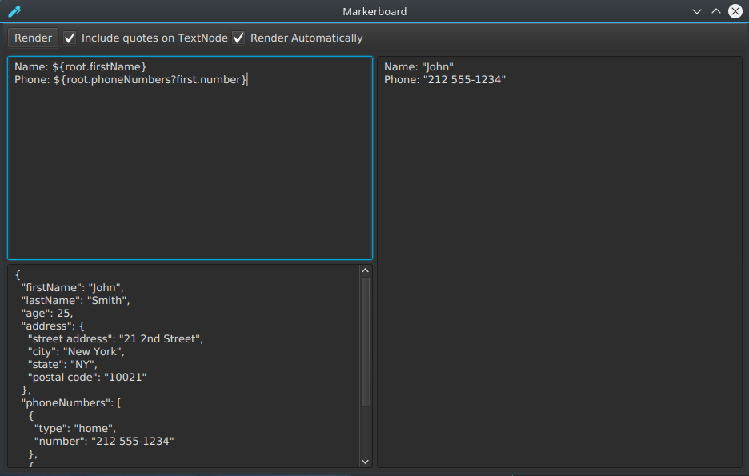

# Markerboard

This is a simple GUI that lets you test out Freemarker templates.
On the left-hand side, you write Freemarker templates and JSON to be
used as the data model. The right-hand side shows the result
of processing the template with that data model.
The data model you pass in is wrapped in a singleton map called
`root`. 





This program uses the Jackson library to deserialize the 
JSON you enter into an `ObjectNode`. `ArrayNodes` are not natively
handled correctly by Freemarker, so this program also uses a custom Freemarker
ObjectWrapper (`ArrayNodeAwareObjectWrapper`) that lets Freemarker 
templates access Jackson `ArrayNodes` as sequences.
This ObjectWrapper adapts ArrayNodes and ObjectNodes into a custom implementation of 
the Freemarker TemplateSequenceModel and TemplateHashModel.
It can be configured to turn default behavior of quoting TextNodes
on/off.

The TemplateHashModel interface is used so that ArrayNodes containing
objects that are name/value pairs can be used in a template as if the
array was actually a hash of the names to the values.
For example, if the data model looked like this:
```json
{
    "valuePair": [
         {"name": "x", "value":"foo"},
         {"name": "y", "value":"bar"},
         {"name": "z", "value":"yak"}
    ]
}
```

Then the Freemarker template could access these values like so:
```ftl
The value of x is ${root.valuePair.x}.
```


## Build & Run
This program requires JDK11 (tested with openjdk11).
To build and run the program, use Maven:
```
mvn javafx:run
```
To produce an executable jar that you can click on to run,
use 
```
mvn compile package
```
The resulting jar will be in the `shade` directory.


## Example
Example Freemarker template:
```ftl
Name: ${root.firstName}
Phone: ${root.phoneNumbers?first.number}
```

Example JSON data model:
```json
{
  "firstName": "John",
  "lastName": "Smith",
  "age": 25,
  "address": {
    "street address": "21 2nd Street",
    "city": "New York",
    "state": "NY",
    "postal code": "10021"
  },
  "phoneNumbers": [
    {
      "type": "home",
      "number": "212 555-1234"
    },
    {
      "type": "fax",
      "number": "646 555-4567"
    }
  ]
}
```
